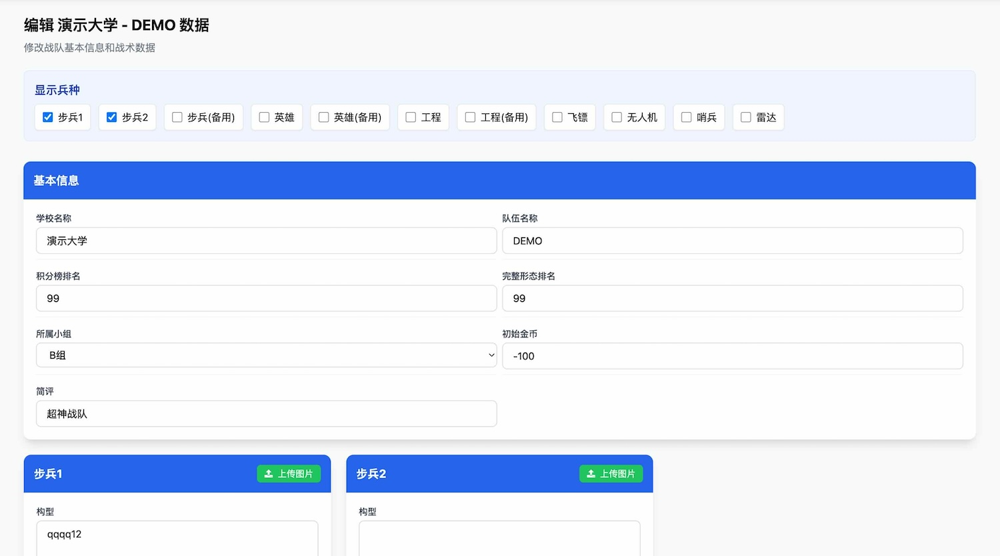
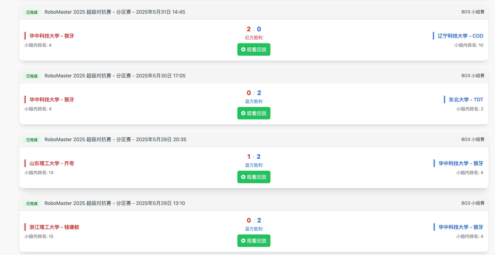
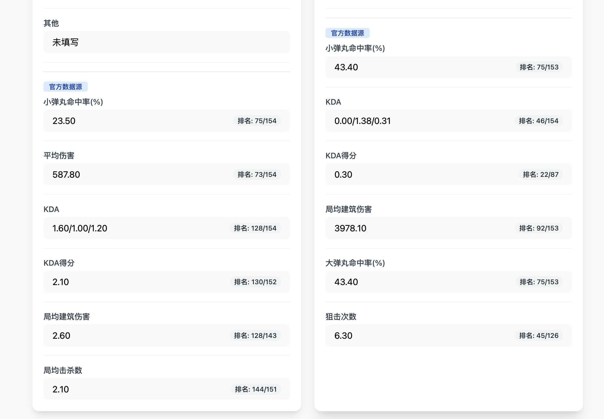

## RM Intelligence HUB

本项目旨在提供一个战队情报管理系统，帮助RM战队管理比赛过程中收集的各战队的情报信息。

## 主要功能

- 编辑战队情报信息

- 接入API获取比赛信息

- 接入API获取战队数据


## 使用方法

1. 克隆本项目到本地
```bash
git clone git@github.com:MicDZ/RM_Intelligence_HUB.git
cd RM_Intelligence_HUB
```

2. 安装依赖
```bash
pip install -r requirements.txt
```

3. 启动
```bash
RMINTEL_LOGIN_PASSWORD=password python app.py
```

其中的password即为系统登录密码。

## 致谢

感谢狼牙战队 李磊 提供的创意和原始实现。
感谢狼牙战队所有老队员在分区赛和复活赛期间对狼牙战队的支持。

如果您觉得这个项目有帮助，欢迎在GitHub上给我一个Star！

如果您有任何建议或问题，欢迎与我联系[me@micdz.cn](mailto:me@micdz.cn)。
